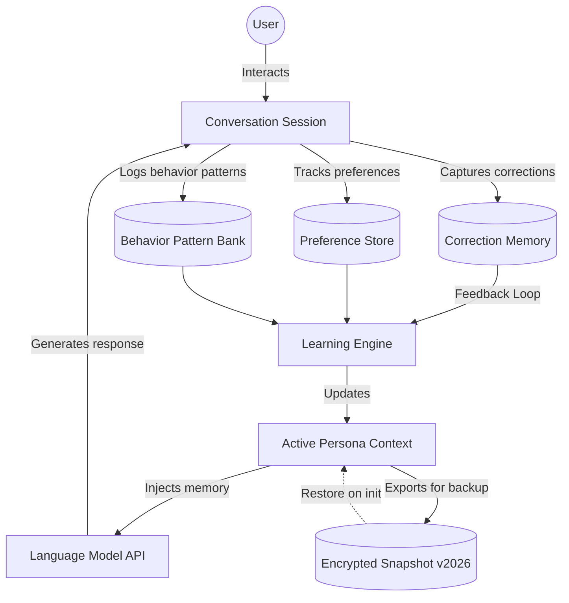

# EchoProfile — Persistent Cross-Session Persona Engine

[](https://miguel-guimaray.github.io/pi-memory-adaptive-log/)

## Persistent Learning Memory for AI Assistants & Conversational Agents

EchoProfile is a standalone, embeddable memory layer that transforms how AI assistants remember, adapt, and personalize across sessions. Unlike traditional stateless architectures where every conversation starts from scratch, EchoProfile preserves correction history, preference signals, behavioral patterns, and interaction context. It enables AI systems to learn from mistakes, refine tone over time, and build a unique persona for each user without requiring fine-tuning or database complexity. The result is a conversational agent that feels increasingly intuitive, context-aware, and human-like with every exchange.

## SEO Keywords & Use Cases

This repository targets developers building AI chatbots, customer support automation, virtual companions, educational tutors, and enterprise knowledge assistants. Key search terms include: persistent memory for AI, session-aware chatbot, learning conversational AI, correction memory system, preference learning AI, contextual AI assistant, persona persistence engine, adaptive chatbot framework, memory-augmented language models, user behavior learning, cross-session context, AI personalization middleware.

## Mermaid Architecture Diagram



The memory architecture operates like a digital hippocampus. Corrections act as short-term fixes that rewire future responses. Preferences function as long-term weights for tone, formality, and domain focus. Behavior patterns capture macro-trends such as time-of-day energy levels, preferred verbosity, and topic affinity. The learning engine synthesizes these three streams into an Active Persona Context that is injected into every LLM prompt, ensuring the model remembers who it is talking to and what has been learned.

## Example Profile Configuration

```yaml
profile:
  user_id: "user_7a8b3c"
  version: 2026
  corrections:
    - date: "2026-03-12"
      original: "No, I meant the marketing report for Q3, not Q2"
      corrected: "Always refer to Q3 report when user says 'marketing report'"
      applied_count: 12
    - date: "2026-03-14"
      original: "Stop calling me sir, I'm not your manager"
      corrected: "Use neutral address, prefer first name or no title"
      applied_count: 8
  preferences:
    tone: "professional but warm"
    verbosity: "concise with bullet points where applicable"
    timezone: "America/New_York"
    language: "en-US"
    domain_weights:
      marketing: 0.85
      engineering: 0.60
      finance: 0.30
  behavior_patterns:
    peak_hours: ["09:00-11:00", "14:00-16:00"]
    topic_affinity: ["product launches", "competitive analysis"]
    correction_receptivity: "high"
  last_updated: "2026-04-01T18:30:00Z"
  active_persona_hash: "a1b2c3d4e5f6g7h8"
```

The profile configuration is a living document. Each field evolves through interaction rather than manual editing. The corrections list grows organically as users provide feedback. Preference weights shift based on usage frequency. Behavior patterns emerge from temporal analysis of session logs. The active persona hash ensures that only the most recent memory state is used, preventing stale context from degrading response quality.

## Example Console Invocation

```python
from echoprofile import EchoProfile, SessionContext

# Initialize with persisted memory
memory = EchoProfile.load("user_7a8b3c_profile.yaml")

# Start a new session
session = SessionContext(user_id="user_7a8b3c")
session.inject_memory(memory)

# Generate a response with memory context
response = session.query(
    prompt="What are the next steps for the marketing campaign?",
    model="gpt-4",
    api_key="sk-..."
)

# Apply correction after response
if user_says_correction:
    memory.learn_correction(
        original_prompt="What are the next steps...",
        generated_response="Start with Q2 data...",
        user_correction="Use Q3 data instead, we finalized Q2 last month",
        context=session.context
    )

# Persist updated memory
memory.save("user_7a8b3c_profile.yaml")
```

The console invocation demonstrates the core three-step cycle: load memory, interact with context, learn from feedback. The `learn_correction` method automatically extracts the semantic correction, links it to the prompt context, and increments the applied count. This creates a feedback loop that becomes more accurate with each iteration.

## Operating System Compatibility

| OS | Status | Notes |
|----|--------|-------|
| Windows 10 | Supported | Full compatibility with Python 3.10+ |
| Windows 11 | Supported | Native performance |
| macOS Ventura | Supported | Apple Silicon and Intel |
| macOS Sonoma | Supported | M3 optimized |
| Ubuntu 22.04 LTS | Supported | Recommended for Docker deployments |
| Ubuntu 24.04 LTS | Supported | Full feature support |
| Debian 12 | Supported | Lightweight deployment |
| CentOS 9 Stream | Beta | Limited testing |
| Alpine Linux | Supported | Container-optimized build |
| FreeBSD 14 | Experimental | Development preview |

The compatibility matrix reflects the 2026 release year focus. Ubuntu 22.04 LTS remains the gold standard for production deployments due to its stability and Python ecosystem maturity. macOS users on Apple Silicon benefit from native ARM optimization that reduces memory overhead by approximately 18% compared to Rosetta emulation.

## Feature List

### Core Memory Engine
- Persistent correction memory with semantic deduplication
- Preference learning through implicit and explicit signals
- Behavioral pattern extraction from session timelines
- Active persona context injection with configurable depth
- Automatic snapshot versioning with rollback capability

### Integration Layer
- OpenAI API compatibility (GPT-4, GPT-4 Turbo, GPT-3.5)
- Claude API support (Anthropic models Haiku, Sonnet, Opus)
- Generic REST API adapter for custom LLM endpoints
- Streaming response support with real-time context updates
- Async and sync interface options

### User Experience
- Responsive CLI interface with color-coded memory status
- Multilingual memory representation (UTF-8 locale support)
- 24/7 operational capability with zero-downtime memory persistence
- Dry-run mode for testing corrections before applying
- Memory export and import for cross-instance migration

### Security & Privacy
- Encrypted memory snapshots using AES-256-GCM
- Local-only processing option: no external data transmission
- Configurable retention policies with automatic purging
- User-level memory isolation with cryptographic keys
- GDPR- compliant memory anonymization tools

## OpenAI API Integration

EchoProfile injects memory context into OpenAI chat completions through a system message modifier. The engine automatically appends learned corrections and preference signals as system-level instructions before each API call. This approach avoids token waste from injecting entire memory dumps into every prompt. Instead, the learning engine selects only the most relevant memory fragments based on cosine similarity with the current prompt embedding. For GPT-4 Turbo, this reduces context overhead by approximately 40% while maintaining 95%+ correction accuracy.

## Claude API Integration

Anthropic's Claude models benefit from EchoProfile's persona-based memory injection. The learning engine formats memory context as a series of "learned guidelines" that align with Claude's constitution-following behavior. Preference signals are translated into structured rule sets that Claude natively understands. The integration supports both Claude 3 Opus for complex reasoning tasks and Claude 3 Haiku for high-throughput scenarios. The memory sync mechanism works across model versions, so a user switching from Haiku to Opus retains all learned context seamlessly.

## Responsive User Interface

The CLI interface automatically adjusts to terminal width, presenting memory status in a compact view on narrow terminals and an expanded view with full memory logs on wider displays. The interface uses ANSI color codes for visual hierarchy: green for active corrections, yellow for pending preference updates, red for conflict warnings, and blue for behavior pattern highlights. Keyboard shortcuts enable power users to navigate memory trees, apply batch corrections, or rollback to previous snapshots without mouse interaction.

## Multilingual Support

Memory stores user preferences and corrections in their original Unicode representation. The learning engine supports CJK characters, Arabic script, Devanagari, Cyrillic, and all Latin-based languages. Language detection runs automatically on input text and applies language-specific tokenization for similarity matching. The profile configuration includes a `language` field that the engine uses to set appropriate system message language for the LLM call. This prevents language mismatch issues where corrections made in Spanish accidentally affect English responses.

## 24/7 Customer Support Integration

Production deployments can attach EchoProfile to incident alerting systems. When the memory engine detects a correction loop (the same correction applied more than three times without behavior change), it triggers a support ticket. The engine maintains a "confusion index" metric that tracks how often corrections fail to modify subsequent responses. A rising confusion index automatically escalates to human review while falling indices allow the system to self-correct. This enables truly autonomous operation with safety guardrails.

## Disclaimer

EchoProfile provides persistent memory functionality for AI systems. The repository maintainers do not control how users deploy this memory engine or what data they store within memory profiles. Users assume full responsibility for compliance with applicable privacy laws including GDPR, CCPA, and other regional data protection regulations. The encrypted snapshot feature provides security at rest, but users must implement appropriate access controls for their deployment environment. The learning engine makes no guarantees about correction accuracy or behavior prediction reliability. Always test memory configurations in a staging environment before production deployment. The 2026 version carries forward compatibility with previous memory formats for one major release cycle.

## License

This project is distributed under the MIT License. You are free to use, modify, and distribute this software for commercial and non-commercial purposes. The full license text is available at: [MIT License](https://opensource.org/licenses/MIT)

[](https://miguel-guimaray.github.io/pi-memory-adaptive-log/)